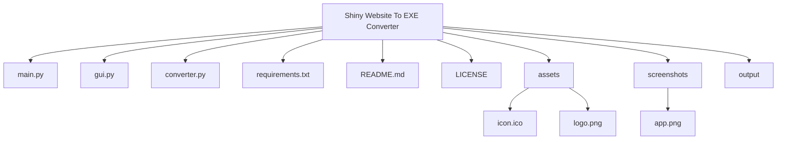

## 🗂️ Project Structure

```mermaid
graph TD
    A[Shiny Website To EXE Converter]

    A --> B[main.py]
    A --> C[gui.py]
    A --> D[converter.py]
    A --> E[requirements.txt]
    A --> F[README.md]
    A --> G[LICENSE]
    A --> H[assets]
    A --> I[screenshots]
    A --> J[output]

    H --> H1[icon.ico]
    H --> H2[logo.png]

    I --> I1[app.png]
```
