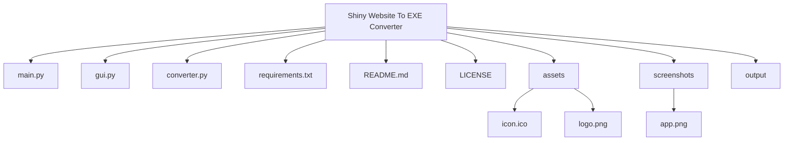
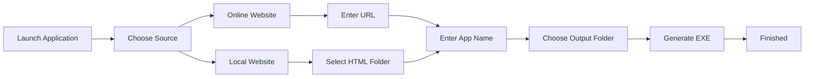
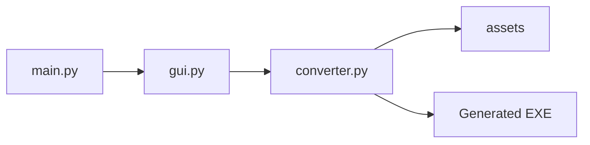
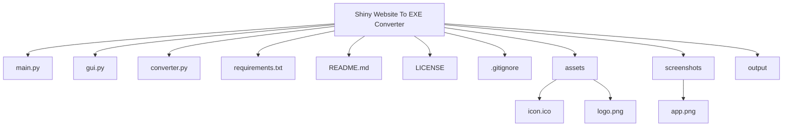
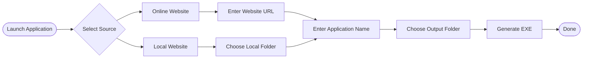

## 🗂️ Project Structure



## ⚙️ How It Works




# 🌐 Shiny Website To EXE Converter

> Convert any website into a standalone Windows executable with a modern, bilingual interface.

<p align="center">
  
</p>

<p align="center">


</p>

---

## ✨ Overview

**Shiny Website To EXE Converter** is an open-source Python application that packages websites into standalone Windows desktop applications.

Whether your website is hosted online or stored locally, the application generates a Windows executable with a simple and user-friendly interface.

The application is designed for developers, students, businesses, and anyone who wants to distribute a website as a desktop application.

---

## 🚀 Features

- 🌍 Convert online websites into Windows applications
- 📁 Convert local HTML/CSS/JavaScript projects
- 🖥️ Custom application name
- 📂 Select custom output folder
- 🎨 Modern dark-themed interface
- 🌐 English & Arabic interface
- ⚡ Fast conversion process
- 🔧 Easy to use
- 💻 Built with Python

---

# 📸 Screenshot

<p align="center">

</p>

---

# 🏗️ Project Architecture



---

# 📂 Project Structure



---

# ⚙️ Conversion Workflow



---

# 🖥️ Interface

The application contains two main conversion modes.

### 🌍 Online Website

Convert any hosted website by entering its URL.

### 📁 Local Website

Convert a local HTML project containing HTML, CSS and JavaScript files.

---

# 📦 Installation

Clone the repository

```bash
git clone https://github.com/MasterKing67/Shiny-Website-To-Exe-Converter.git
```

Move into the project directory

```bash
cd Shiny-Website-To-Exe-Converter
```

Install dependencies

```bash
pip install -r requirements.txt
```

Launch the application

```bash
python main.py
```

---

# 🛠️ Requirements

- Python 3.10 or newer
- Windows 10 or Windows 11

Python packages

```
PySide6
pyinstaller
requests
```

---

# 📁 Directory Layout

```
Shiny-Website-To-Exe-Converter
│
├── main.py
├── gui.py
├── converter.py
├── requirements.txt
├── README.md
├── LICENSE
├── .gitignore
│
├── assets
│   ├── icon.ico
│   └── logo.png
│
├── screenshots
│   └── app.png
│
└── output
```

---

# 💡 How It Works

1. Launch the application.
2. Choose **Online Website** or **Local Website**.
3. Enter your application name.
4. Select an output directory.
5. Click **Generate EXE**.
6. The application packages your project into a standalone Windows executable.

---

# 🎯 Planned Features

- ✅ Custom application icons
- ✅ Splash screen support
- ✅ Window customization
- ✅ Offline asset packaging
- ✅ Automatic updates
- ✅ Installer generation
- ✅ Code signing support
- ✅ Portable mode
- ✅ Multi-language support

---

# 🤝 Contributing

Contributions are welcome!

1. Fork this repository.
2. Create a new branch.

```bash
git checkout -b feature/my-feature
```

3. Commit your changes.

```bash
git commit -m "Add new feature"
```

4. Push your branch.

```bash
git push origin feature/my-feature
```

5. Open a Pull Request.

---

# 🐞 Issues

Found a bug?

Please open an Issue and include:

- Python version
- Windows version
- Steps to reproduce
- Screenshots (if applicable)

---

# 📄 License

This project is licensed under the **MIT License**.

See the **LICENSE** file for more information.

---

# 👨‍💻 Author

**Shiny Studios**

Developed with ❤️ using Python.

---

# ⭐ Support

If you found this project useful,

⭐ Star the repository

🍴 Fork the project

💬 Share feedback

Your support helps improve future releases.

---
```
